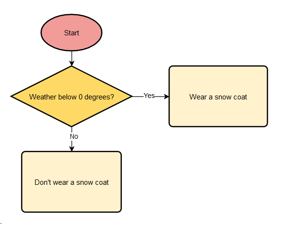

# Lesson 3: If-Statements

## Introduction
People have to make decisions everyday: You might need to choose whether to wear a snowcoat. We can make these decisions by thinking about *conditions*. For example, to decide whether you need to wear a snowcoat, you might first look at the weather.

This is a *flowchart*:



Flowcharts help us plan out decisions and the *flow* of decision-making. While programming, it's helpful to think of there being a flow that the program follows depending on certain conditions (Like the weather being below 0 degrees).

## Decision-making in Programs
If-statements allow us to add a flow of decision-making to our programs. They run certain blocks of code *if* a *condition* is met.

This decision making is super important to making good programs. For example:
- *If* the password is correct, *then* allow access.
- *If* Mario falls out of the world, *then* remove 1 from the life count.
- *If* Alice's number is higher, *then* give her a point, *otherwise* give Bob a point.

What other if-then or if-then-otherwise sentences can you come up with?

## Conditions
A condition is an event or property of something that acts as the reasoning behind a decision.

In computer programs, conditions are also called *boolean expressions*. Boolean expressions are statements that are either **true** or **false**.

### Conditional Operators
| Operator | Meaning | True Statement | False Statement |
|:---:| --- |:---:|:---:|
|> |Greater than| 10 > 9 | 3 > 10 |
|>=|Greater than or equal| 10 >= 9, 10 >= 10 | 3 >= 20 |
|< |Less than| 9 < 10 | 12 < 2 |
|<=|Less than or equal| 7 < 12, 6 <= 6 | 3 <= 2
|==|Equal| 2 == 2 | 2 == 3 |
|!=|Not Equal| 3 == 12 | 30 == 30 |

We can use conditional operators to compare two values. This is pretty important:
- *if* Mario's `lives == 0`, *then* write "Game Over".
- *if* `time == 7:00`, *then* ring alarm clock.

## If, Elif, Else
Now it's time to actually write some decision-making code.

**if** lets us run a piece of code *only if* a condition (AKA boolean expression) is `True`.

```python
x = int(input("Tell me your favourite number: ")) # Get a user input

if x == 9:
    print("Nine is my favourite number too!")
print("Thanks for using my program.")

# Notes:
# 1. After the "if" we put a condition.

# 2. After the "if" + condition,
#    we must always put a colon ":".

# 3. The INDENTED code will only run if x is equal to 9.
#    Indents are the spacings before lines of code.
#    Press TAB to make an indent.
```
Let's try running this program.
```
>>> python3 program.py
Tell me your favourite number: 9
Nine is my favourite number too!
Thanks for using my program.

>>> python3 program.py
Tell me your favourite number: 7
Thanks for using my program.
```

**else** lets us run a piece of code if the `if` block didn't run.

```python
colour = input("What's your favourite colour: ")

if colour == "blue": # We can use "!=" and "==" on strings too.
    print("Same!!")
else:
    print("My favourite colour is blue.")
print("bye bye")
```
Let's give this program a go:
```
>>> python3 program.py
What's your favourite colour: blue
Same!!
bye bye

>>> python3 program.py
What's your favourite colour: red
My favourite colour is blue.
bye bye
```

**elif** lets us run a piece of code if the `if` block didn't run. However, `elif` blocks will only run if some other condition is `True`. *elif* is a shortening of "else if".

```python
temperature = int(input("What temperature is it: "))

if temperature > 15:
    print("Wear a T-shirt")
elif temperature < 10:
    print("Wear a jacket")
else:
    print("Wear a sweater")
print("Seeya later")

# Note: "else" doesn't need a condtion.
```
Let's try it out:
```
>>> python3 program.py
What temperature is it: 26
Wear a T-shirt
Seeya later

>>> python3 program.py
What temperature is it: -4
Wear a jacket
Seeya later

>>> python3 program.py
What temperature is it: 12
Wear a sweater
Seeya later
```


## Challenges
### Flowcharts
Make a flowchart and then turn it into Python code. The flowchart can be about anything (eg. What to wear, what to eat, etc.).

### Number Guesser
Make a program where the user has to guess a number. Print "Good job!" if the number is less than seven but greater than or equal to three. If the number is too big, print "TOO LARGE". If the number is too small, print "TOO SMALL".

<details>
<summary>Hint</summary>
You will need to use: if, elif, else statements. You will also need to use "<" and ">=".
</details>

<details>
<summary>Answer</summary>
There are many possible solutions, here's mine:

```python
guess = int(input("Guess a number: "))

if guess >= 7:
    print("TOO BIG")
elif guess < 3:
    print("TOO SMALL")
else:
    print("Good job!")
```
</details>
