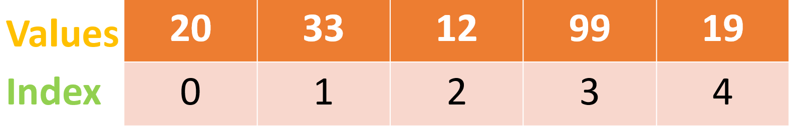

# Lesson 5: Lists

## Introduction
Usually, we store a value in a *variable*. We can read this value or change it throughout the program. So far, the variables we've looked at are all single pieces of data (eg. a number, a string, a float, etc.).

What do we do if we need to store a collection of values? For example:
- A list of temperatures over the past year.
- A list of names in the attendance system.
- A sequence of frames in an animation.
- And others...

## Lists
In Python, we can use *lists* to store a collection of values. (Lists can also be called *Arrays* or *Sequences*)

To create a list:
```python
my_list = [1, 2, 3, 4] # A list with the numbers from 1 to 4
```
This list stores a *collection* of numbers! There are lots of applications: like storing the high scores in a leaderboard, among others.
```python
word_list = ["cow", "broom", "computer", "sunny"] # Lists can store anything
list_of_lists = [[1, 1], [1, 1]] # Even other lists! 
empty_list = [] # We can make empty lists too
```

### Indices
(Indices is the plural of index)

Every item in a list has an *index*. Indices describe the position of an item in a list.



**NOTE:** Programmers always start counting at zero!
- The **zero***th* item is 20
- The *first* item is 33
- The *second* item is 12
- And so on...

## List Operations

0. Access

    We can get the value at some index in a list using *square brackets* `[]`.
    ```python
    my_array = [2021, 100, 1337, 9001]
    print(my_array[2])

    >>> python3 program.py
    1337
    ```

1. Updating

    We can change the value at some index in a list using *square brackets* `[]`.
    ```python
    list_of_stuff = [100, 200, 300, 400]
    print(list_of_stuff)
    
    list_of_stuff[2] = 1337
    print(list_of_stuff)

    >>> python3 program.py
    [100, 200, 300, 400]
    [100, 200, 1337, 400]
    ```

2. Concatenation

    We can attach two lists together by adding them using `+`
    ```python
    listy = [20, 7, 1]
    listx = [1010101, 2, 2, 2, 2]

    listz = listx + listy

    print(listz)

    >>> python3 program.py
    [1010101, 2, 2, 2, 2, 20, 7, 1]
    ```

3. Slicing

    We can get a section of a list using *square brackets with a colon* `[start:end]`

    This is called *slicing* because it's like we're slicing out a section of the list.

    - `start`: The index of the first item of the slice.
    - `end`: The index of the item **after** the last item.

    `my_list[start:end]` gives a list of the items starting from the item at index `start` and ending at (BUT NOT INCLUDING) the item at index `end`

    ```python
    x = [1, 1, 3, 7, 20, 8, 13]
    print(x[2:5])

    # start index is 2
    # end index is 5
    # The range of indices is 2, 3, 4
    # NOTE: the end index, 5, is NOT included!

    >>>python3 program.py
    [3, 7, 20]
    ```

    ```python
    x = [2, 2, 56, 12, 123, 43]

    # If we leave out the start index, we can get a slice from the first item of the list to the end index.
    print(x[:3])
    
    # If we leave out the end index, we can get a slice from the start index to the last item of the list.
    print(x[3:])

    # If we leave out both the start and the end, we get a slice from the start of the list to the end of the list.
    print(x[:])

    # NOTE: Slicing actually works exactly like the range() function. To get the step, we can add a third colon.
    print(x[::2]) # This prints a list of every other item.

    # Here's how to reverse a list
    print(x[::-1])

    >>> python3 program.py
    [2, 2, 56]
    [12, 123, 43]
    [2, 2, 56, 12, 123, 43]
    [2, 56, 123]
    [43, 123, 12, 56, 2, 2]
    ```

    **Why isn't `end` included?**
    ```python
    x = [0, 1, 2, 3, 4, 5]
    print(x[:2] + x[2:]) # So we can do this

    >>> python3 program.py
    [0, 1, 2, 3, 4, 5]
    ```

4. Append, remove

    We can add an item `x` to the end of a list using `.append(x)`

    We can delete the item at the index `i` using `.pop(i)`

    ```python
    a = [4, 3, 1]
    print(a)

    a.append(1337)
    print(a)

    a.pop(1)
    print(a)

    >>> python3 program.py
    [4, 3, 1]
    [4, 3, 1, 1337]
    [4, 1, 1337]
    ```

5. Sorting
    We can easily sort the items in a list from lowest to highest using `.sort()`
    ```python
    x = [5, 3, 9, 2]
    x.sort()

    # x is now sorted
    print(x)

    >>> python3 program.py
    [2, 3, 5, 9]
    ```


## Lists and Loops
Remember `for` loops? We can go through (AKA *iterate* through) a list using `for` loops!

```python
list_of_numbers = [9, 1, 23, 111]
for x in list_of_numbers:
    print(x)

>>> python3 program.py
9
1
23
111
```

What's more, it's also possible to loop through lists of strings too.
```python
attendance_list = ['Albert', 'Colbert', 'Bertha', 'Bertholt', 'Sherbet']
for name in attendance_list:
    print('Is ' + name + ' here?')

>>> python3 program.py
Is Albert here?
Is Colbert here?
Is Bertha here?
Is Bertholt here?
Is Sherbet here?
```

Sometimes, you need to work with the indices of a list.

For example, you might need to compare each number with the number in front of it. To do this, you would need to know the index of the current item of the list.

```python
x = ['pizza', 'spaghetti', 'lasagna', 'tomato']
for i in range(len(x) - 1): # NOTE: len() gives the length of a list
    # Notice how the range is len(x) - 1.
    # We do this because we can't compare the last item with any items that are after the last item.
    # (because there are no items after the last item).
    print(x[i], x[i + 1])

>>> python3 program.py
pizza spaghetti
spaghetti lasagna
lasagna tomato
```

You would also loop using indices if you were searching for the position of some item.
```python
x = ['pizza', 'spaghetti', 'lasagna', 'tomato']
index_of_lasagna = -1 # Set this to an invalid number at first.
for i in range(len(x)):
    if x[i] == 'lasagna':
        index_of_lasagna = i
        break # Special command to end a loop
```

**INTERESTING FACT:** You can convert a `range()` into a list using the `list()` fucntion.
```python
print(list(range(10)))

>>> python3 program.py
[0, 1, 2, 3, 4, 5, 6, 7, 8, 9]
```

## 2D Lists
A *two-dimensional list* is a list of lists. They're 2D because they look like a grid of numbers when you imagine them.

```python
# This is a 2D list!
# Note that the "sublists" can be different sizes
# It can also be written as [[1, 0, 0], [0, 1, 0], [0, 0, 1]]
two_d_list = [[1, 0, 0],
              [0, 1, 0],
              [0, 0, 1]]

for i in range(len(two_d_list)): # Iterate through each "sublist" AKA each "row"
    for j in range(len(two_d_list[i])): # Iterate through each item of the current row
        print(two_d_list[i][j])
        # WOAH! Remember that two_d_list is just a list of lists.
        # Meaning that we can use the "[]" square brackets on each "sublist" (aka row) in two_d_list.
    print() # Prints an empty line

>>> python3 program.py
1
0
0

0
1
0

0
0
1
```

There are several use-cases for 2D lists. For example, the school principal might need a list of attendance lists for each class.

## List Properties
0. The items in a list always keep the order that they were added in.
    ```python
    x = [4, 12]
    x.append(7)
    x.append(8)

    # 4 will always be the zeroth item
    # 12 will always be the first item
    # 7 will always be the second item
    # 8 will always be the third item
    ```
1. Lists can change size
2. The value at an index in an array can be changed (eg. `x[2] = 3`)
3. Lists can contain any types of values (integers, strings, floats)
4. Lists can be put in lists.

## Challenges
[UNDER CONSTRUCTION]