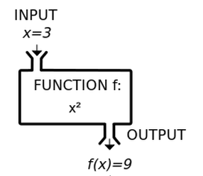

# Lesson 6: Functions

## Introduction
Imagine a situation where you have to use the same piece of code in two different places. Wouldn't it be tedious to write the same stuff over and over again?

**functions** are a great solution to this problem.

### What are Functions?
Functions are little snippets of code that are given an *input* and returns an *output*. These snippets can be reused over and over again by calling their *name*.



^ An example of a mathematical function which squares the input.

## Functions
Before we get started with writing our own Python functions, let's go over some terms.
- **Parameter**: The variable name of an input to the function.
- **Argument**: The value of an input passed to the function.
- **Return Value**: The value of the output that the function "returns" to us.
- **Call**: When we use a function in our code, we "call" it. Kind of like "calling" the fire department to help us out.

Now let's make a function in Python:
```python
# This function adds two numbers
def my_first_function(param_1, param_2): # use "def" to define a function
    # The parameters are param_1 and param_2
    return param_1 + param_2 # Return the output using the "return" keyword

# We can call our function by putting parentheses after its name and adding arguments.
# This will print out whatever my_first_function(1, 4) returns to us.
print("1 + 4 is", my_first_function(1, 4)) # The arguments are 1 and 4

# We can set variables to equal function outputs as well.
x = my_first_function(10, 10)
print("x is equal to", x)
```
```
>>> python3 program.py
1 + 4 is 5
x is equal to 20
```

Let's make a more complicated function
```python
def check_coolness(favorite_color):
    # If your favorite color is blue, you are cool.
    if favorite_color == 'blue':
        return True
    else:
        return False

# NOTE: Whenever the program reaches a "return" statement in a function, the function IMMEDIATELY stops and the function ends.
def also_valid_check_coolness(favorite_color):
    if favorite_color == 'blue':
        return True
    return False

    # This works because the function exits if it hits the "return True" part.
    # So if favorite_color is blue, "return False" won't be reached.


# Note that these functions return True/False! So we can use them in if-statements.
if check_coolness('vomit green'):
    print('You are cool')
else:
    print('You are not cool >:(')

if also_valid_check_coolness('blue'):
    print('You are coolio')
else:
    print('You are not coolio ;~;')
```
```
>>> python3 program.py
You are not cool >:(
You are coolio
```

*Procedures* are similar to functions. However, they don't return an output. Intead, they do something with their inputs.
```python
def my_procedure(name):
    print("Hello " + name + "! Welcome to my procedure!")

# Procedures are technically functions, just without a return statement.
# When there is no return statement, the function returns None

print(my_procedure("Trevor"))

>>> python3 program.py
Hi Trevor! Welcome to my procedure!
None
```

## Scope
When functions are very complex, you can even make variables in them.
```python
def print_x(): # Empty brackets means that the function doesn't need input.
    x = 12
    print(x)

print_x() # This prints x, which is 12

# Case 1: Imagine this situation:
x = 10
print_x() # Which x does it print? Does it print the x on the outside or the x on the inside?

# Case 2: Imagine a situation where x doesn't exist
del x # Deletes x
print_x()
print(x) # Does x still exist?
```

This is where the idea of *scope* comes into play. Let's try running the program.
```
>>> python3 program.py
12
12
NameError: name 'x' is not defined
```

Okay, so Case 1 printed 12, which is the value of `x` inside the function. Case 2 gave us an error saying that `x` doesn't exist. These can be explained using the concept of scope.

**Definition of Scope**: A separated bubble of existence for variables. When a variable is created in a scope, it only exists in that scope.
- So far, we've been working with the **global scope**, which is just the entire program.
- However, you can have scopes within scopes (imagine bubbles within bubbles).

In Python, functions create their own scope that's contained within the global scope. This is called **local scope**.

For Case 2: `x` didn't exist because we were trying to access a variable in the *local scope* of `print_x()` from the *global scope*. `x` only exists in the local scope!

For Case 1: The `print(x)` in the function `print_x()` had two choices: print the x in *global scope* or to print the x in its current *local scope*. Both are valid. But when given the choice, Python prefers to use the variable that's in the current scope. This is why the `print(x)`, which is in the *local scope* of `print_x()`, decided to use the `x` that was also in the *local scope* of `print_x()`.

## Challenges
[UNDER CONSTRUCTION]