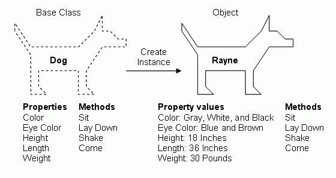
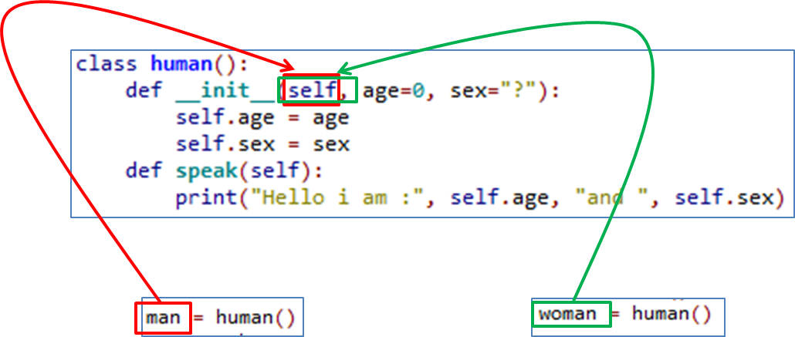

# Lesson 8: Object Oriented Programming

## Introduction: What are Objects?

In programming, objects are "things" that have attributes in do stuff, just like objects in real life. For example, a *dog* would be an object that has a specific breed (eg. corgi) and is able to perform actions (eg. barking, running).

- **Attribute**: A property of an object (eg. colour, height, weight).
    - Attributes are usually stored as numerical values (eg. A dog with a *weight* attribute of 10kg)
- **Method**: An action that an object performs (eg. run, jump, refuel, brake).

### Classes

We can group objects of the same type into classifications (called "*classes*"). For example, Marley the Dachshund and Cory the Corgi are both classified as *dogs*.

Objects of the same class must have the **same attributes** and **same properties**.


Marley and Cory have the same *attributes* with different values: They both have two ears, but Cory has pointy ones and Marley has floppy ones. Since they have the same attributes, they are of the same *class* (dog).

## Python Classes

*Object Oriented Programming* (OOP for short) is a style of programming that uses *objects* to store and work with data.

Classes and objects in programming work in the same way they work in real life: Objects are grouped together into classes based on their similarity.

In programming, *classes* are like *blueprints* that can be used to *construct* new objects. Classes define what attributes and methods its objects contain.

- **Attributes**: An attribute is a *numerical* value stored in an object. The attributes of an object depends on its class (eg. car class would store the amount of fuel).
- **Methods**: A method is a function that is performed by an object. Methods usually access or modify the values of the attributes of the object that performs it. The methods that an object has is also determined by its class.


A car has:
- Attributes: Fuel, Max Speed
- Methods: Refuel, Drive, etc. (don't worry about getFuel, getSpeed, setSpeed)

Here's an example of the *construction* of a Dog object from a Dog class.



(Note: *Property* and *Attribute* mean the same thing)

Now let's take a look at how we would do this in Python code. Let's make a car class.

```python
class Car:
    def __init__(self, model, max_speed):
        self.model = model
        self.max_speed = max_speed
        self.current_speed = 0
    
    def say_model_name(self):
        print('Hi! I am a ' + self.model + '!')
```

Now let's take some time to digest all this.

The first line is `class Car:`. It tells the computer that we want to create a class that's called car. The naming convention for classes is `PascalCase` (from last lesson).

Then, there's a funky function called `__init__(self, model, max_speed)` in the body of the class definition. This is called a *constructor*, a special function that actually *constructs* objects of that class.

To construct a `Car` object and store it in a variable, we'd call the `__init__` function.
```python
my_car = Car('Honda Civic 2019', 150)

"""
Adding parentheses after the class name is how you call __init__(). But remember that we defined the constructor to be __init__(self, model, max_speed), but we only passed two arguments!

The "self" argument is actually left out of the __init__() call (it's very weird).
"""
```

To access an attribute, use the `.` (dot) operator.

```python
print(my_car.max_speed)

>>> python3 program.py
150
```

In the body of the class definition, we also defined a *method* called `say_model_name(self)`.

```python
# To call a the say_model_name(self) method, do this.
my_car.say_model_name()

>>> python3 program.py
Hi! I am a Honda Civic 2019!
```

But once again, the `self` parameter is left out from the function call...

### What exactly is `self`?

`self` is a placeholder name for the name of an object of a class.

Notice in the `__init__` function, we defined the max speed of a `Car` object using `self.max_speed = max_speed` and to get the max speed of `my_car` we typed `print(my_car.max_speed)`.

Also notice that we defined the functions in the `Car` class to have a `self` parameter but don't pass the object's name during the function calls. This is because the object name is passed using the `.` (dot) operator (`my_car.say_model_name()`).



The `class human` has the objects `man` and `woman`. However, in the class definition, we need to be able to work with *every* object, so we can't just use `man.age` or `woman.age` in `__init__()`. `self` is a placeholder meaning "any object of the class `human`".

Now let's add another method to our Car class:

```python
class Car:
    def __init__(self, model, max_speed):
        self.model = model
        self.max_speed = max_speed
        self.current_speed = 0
    
    def say_model_name(self):
        print('Hi! I am a ' + self.model + '!')

    def drive(self):
        # A more complicated method called self.drive()
        # This method reads and modifies the current object's attributes.
        if self.current_speed < self.max_speed:
            self.current_speed += 20
    

my_brothers_car = Car('Honda Civic 2011', 100)
print('Constructed my_brothers_car')

for i in range(10):
    print(my_brothers_car.current_speed)
    my_brothers_car.drive()

>>> python3 program.py
0
20
40
60
80
100
100
100
100
100
```